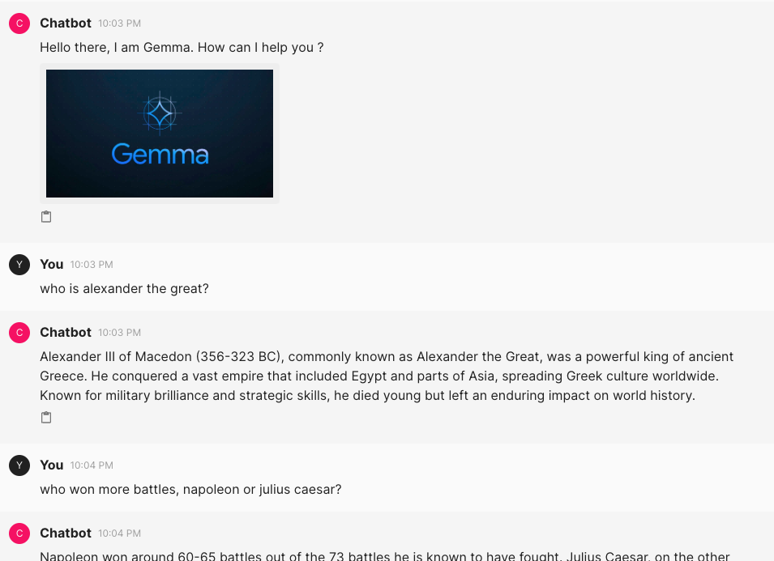

# ollama-conversational-ai

This is divided into 2 parts

- `chainlit-tutorials` - This is just a series of learnings of the chainlit library
- `main.py` - This contains the actual conversational AI stitching Ollama + Mistral + Langchain + Langsmith + Chainlit

## Execute

```sh
chainlit run main.py
```

# Results

Running `main.py` gets you


